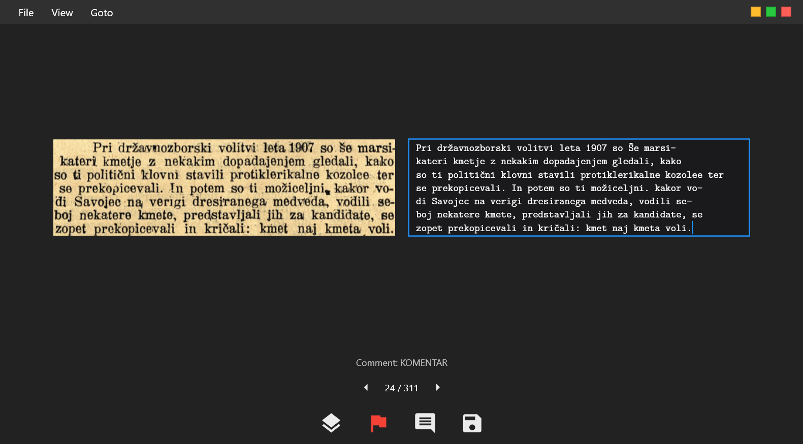

<h1 align="center">Veritium</h1>

<p align="center">
  <strong>Lightweight cross-platform tool for correcting MinerU OCR texts</strong>
</p>

<p align="center">
  
  
  
  
</p>

<p align="center">
  
</p>

## Features

- 📄 Load and correct `_middle.json` files generated by [MinerU OCR](https://github.com/opendatalab/MinerU)
- 🖼️ Side-by-side view of the original image and editable text
- 🔀 Toggle between original and span overlay views
- 🚩 Flag items for review
- 💬 Add comments to any bounding box
- 💾 Auto-save corrections back to the JSON file
- ⌨️ Extensive keyboard shortcuts for efficient workflow
- 🔍 Go to any item by number
- 📐 Adjustable UI scale for different screen sizes

## Installation

You can download the latest release from the GitHub Releases page.

## Development

Dependencies:

- [Flutter SDK](https://docs.flutter.dev/get-started/install) 3.38.4

---

## Usage

1. **Load a file** — Open the app and select `File > Load JSON`, then choose the `_middle.json` file generated by MinerU OCR.
2. **Edit text** — The recognized text appears alongside the cropped image. Make corrections in the text field.
3. **Navigate** — Use the arrow buttons or keyboard shortcuts to move between items.
4. **Flag & Comment** — Mark items for review with the flag button or add comments via the comment button.
5. **Save** — Click the save icon (or press `Ctrl+S`) to write changes back to the JSON file. They are saved as 'corrected_content' fields in each line.

---

## Keyboard Shortcuts

| Shortcut | Action |
|----------|--------|
| `F7` / `Alt + ←` | Previous item |
| `F8` / `Alt + →` | Next item |
| `Ctrl + S` | Save corrected JSON |
| `Ctrl + F` | Toggle flag on current item |
| `Ctrl + T` | Add comment |
| `Ctrl + G` | Go to item |
| `Ctrl + =` / `Ctrl + +` | Increase UI scale |
| `Ctrl + -` | Decrease UI scale |

> 💡 Press `File > Show Keyboard Shortcuts` in the app for a full list.

## Changelog

See [CHANGELOG.md](CHANGELOG.md) for release history and details.

## Documentation

Internal source map and major function reference: [docs/README.md](docs/README.md)

## Contributing

Contributions, issues, and feature requests are welcome!

In case you have issues after updating Visual Studio to the latest version, do the following:

```
rm -rf ./build
flutter clean
flutter pub get
```

Afterwards, it should work again without any issues. As normally, to start the app, run `flutter run` in the root directory.

## License

This project is licensed under the MIT License.